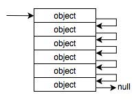
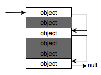
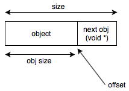
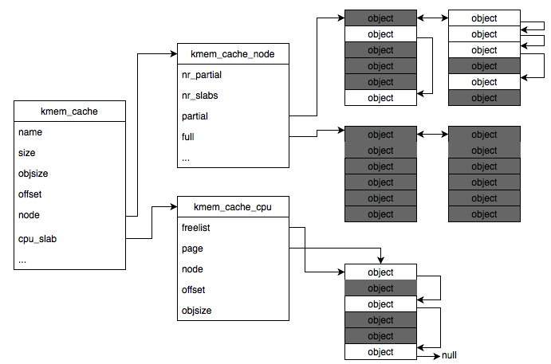

# The SLUB allocator

## Table of contents
* [Why the need of a kernel allocator?](#why-the-need-of-a-kernel-allocator)
* [SLAB](#slab)
* [SLUB](#slub)
    * [Examples](#examples)

## Why the need of a kernel allocator?

The smallest unit of data for memory management in the virtual memory of an OS is the page and its traditional size for most architectures is 4KB.
Since it would be impractical to allocate 4KB of memory every time a process requests something, even as small as dozens of bytes, there needs to be an intermediate mechanism to micro manage the contents of a page.

While in user space this is performed by the **malloc** family, the kernel needs a different system, more tightly integrated with the system itself, that can work in an interrupt context, conformant to DMA restrictions,

For this purpose, the kernel implements an allocator that manages page allocation, fragmentation and redistribution. It basically works as a retail vendor: it acquires big stocks (4KB pages) then deals them in small pieces when the modules need them. The basic version of this allocator is called SLAB.

## SLAB

When a kernel subsystem requests (or frees) data for an object, the major overhead consists in initializing (or destroying) it, rather than allocating memory for it.
If there is a set of common kernel objects that get frequently allocated and freed, keeping them in a fast reachable place makes the whole process more efficient.

This is the principle of SLAB: the allocator keeps track of these chunks, known as **caches**, so that when a request to allocate memory for a data object of a certain type is received, it can instantly satisfy the request with an already allocated slot. In this context, a **slab** is one or more contiguous pages in the memory containing pre-allocated memory chunks.

Slabs may exist in one of the following states:
* empty: all objects in the slab are free
* partial: slab consists in both free and taken objects
* full: all objects in the slab are taken

Of course, the aim of the allocator is to serve requests as quickly as possible, so keeping track of partial slabs is vital. This is done through caches, and there is one cache per object type.

## SLUB

SLUB, the variant of SLAB we are interested in, was designed for better debugging, less fragmentation and better performance. It continues to employ the basic slab-based model, but fixes several deficiencies in SLAB's design, particularly around systems with large numbers of processors.
It has been adopted in the mainline Linux kernel as the default since 2.6.23, in 2008.

Let's look at the implementation details of SLUB, going through examples of common use case scenarios.

First of all, objects in a slab are stored contiguously in memory, but they are logically interconnected through a linked list: in this way the allocator can always find the next free object without caring about data already in use.  

| Fresh slab | Partial slab |
| :-------------: |:-------------:|
|  |  |

In SLUB, as opposed to SLAB, the pointer to the next free object is stored directly inside the object itself, requiring no additional space for metadata and achieving a 100% slab utilization.  
There are very few exceptions to this: in that case the pointer is stored after a certain offset in the object.

| Free object | Used object | Very rare |
| :-------------: |:-------------:|:-------------:|
| |||

Where *objsize* is the size of the object itself, *offset* is the amount of space before the *next* pointer, and size is the total size.

All this information, and much more, is stored *off-slab*, in a data structure that keeps track of this kind of metadata: the **kmem_cache**.  
There is one and only one kmem_cache for each object type, and all slabs of that object are managed by the same kmem_cache. These structs are linked with one another through a double linked list, accessible from everywhere in the kernel thorugh the exported **slab_caches** variable.

Inside a kmem_cache, two kinds of pointers are stored in order to keep track of the slabs: an array of **kmem_cache_node**, and a pointer to a **kmem_cache_cpu**. The latter manages the active slab: it's only one and it's relative to the current cpu (SMD processors can have different active caches). The result of the next allocation will always be returned from the active slab, pointed to by the **freelist** field.
kmem_cache_node, on the other hand, keep track of partial and full slabs that aren't active: they are accessed in case of a free, or when the active slab gets filled up and another partial needs to take its place.

### Examples

#### Standard allocation

From the kmem_cache, the allocator navigates to the kmem_cache_cpu and accesses the freelist to find the first free object, which is returned (in red).
The pointers are updated accordingly to remove it from the linked list and the freelist points to the next free object.

#### Allocation that fills up the active slab, with an available partial

After returning the last object in the active slab, the filled up page gets moved in the full list, while another slab from the partial list becomes the active slab.

#### Allocation that fills up the active slab, with no available partial

After returning the last object in the active slab, the filled up page gets moved in the full list, then the system allocates a fresh slab to become the active slab.

#### Standard free

When the kernel frees an object that belongs to a partial slab (or the active one), SLUB just marks it as free and updates the pointers.

#### Free from empty

When the kernel frees the last object that belongs to a partial slab, the slab is liberated and relinquished to the Memory Management Unit.

#### Free from full

When the kernel frees an object that belongs to a full slab
, the slab is not full anymore and gets moved to the partial list.

